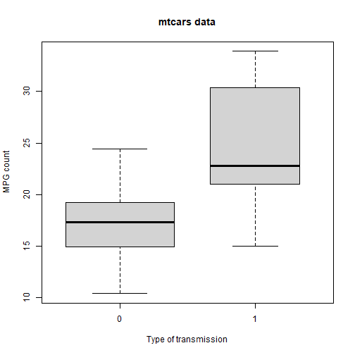
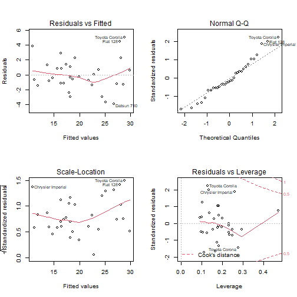

# JHU Coursera Regression Models Final Project

## Author: Shahzaib Siddiqui

You work for Motor Trend, a magazine about the automobile industry. Looking at a data set of a collection of cars, they are interested in exploring the relationship between a set of variables and miles per gallon (MPG) (outcome). They are particularly interested in the following two questions:

- Is an automatic or manual transmission better for MPG?
- Quantify the MPG difference between automatic and manual transmissions

Here we are loading the dataset.

```r
data(mtcars)
```

Plotting the MPG change to transmission modes. 

```r
boxplot(mpg ~ am, data = mtcars,xlab = "Type of transmission", ylab = "MPG count",
main = "mtcars data", varwidth = TRUE, col = "lightgray")
```




The basic view of our dataframe. 

```r
head(mtcars)
```

```
##                    mpg cyl disp  hp drat    wt  qsec vs am gear carb
## Mazda RX4         21.0   6  160 110 3.90 2.620 16.46  0  1    4    4
## Mazda RX4 Wag     21.0   6  160 110 3.90 2.875 17.02  0  1    4    4
## Datsun 710        22.8   4  108  93 3.85 2.320 18.61  1  1    4    1
## Hornet 4 Drive    21.4   6  258 110 3.08 3.215 19.44  1  0    3    1
## Hornet Sportabout 18.7   8  360 175 3.15 3.440 17.02  0  0    3    2
## Valiant           18.1   6  225 105 2.76 3.460 20.22  1  0    3    1
```


Converting the specific variables from numeric as they are factor variables.

```r
mtcars$cyl<-factor(mtcars$cyl)
mtcars$vs<-factor(mtcars$vs)
mtcars$am<-factor(mtcars$am)
mtcars$gear<-factor(mtcars$gear)
mtcars$carb<-factor(mtcars$carb)
```

We will make a linear model of mpg to all the other variables. And let the step() function choose the best model with essential predictor variables. 

```r
mdl<-lm(mpg~.,mtcars)
mdl_final<-step(mdl,direction="both")
```

Let`s have a look at the best model. 

```r
summary(mdl_final)
```

```
## 
## Call:
## lm(formula = mpg ~ cyl + hp + wt + am, data = mtcars)
## 
## Residuals:
##     Min      1Q  Median      3Q     Max 
## -3.9387 -1.2560 -0.4013  1.1253  5.0513 
## 
## Coefficients:
##             Estimate Std. Error t value Pr(>|t|)    
## (Intercept) 33.70832    2.60489  12.940 7.73e-13 ***
## cyl6        -3.03134    1.40728  -2.154  0.04068 *  
## cyl8        -2.16368    2.28425  -0.947  0.35225    
## hp          -0.03211    0.01369  -2.345  0.02693 *  
## wt          -2.49683    0.88559  -2.819  0.00908 ** 
## am1          1.80921    1.39630   1.296  0.20646    
## ---
## Signif. codes:  0 '***' 0.001 '**' 0.01 '*' 0.05 '.' 0.1 ' ' 1
## 
## Residual standard error: 2.41 on 26 degrees of freedom
## Multiple R-squared:  0.8659,	Adjusted R-squared:  0.8401 
## F-statistic: 33.57 on 5 and 26 DF,  p-value: 1.506e-10
```

We can see that the best predictor variables to include in the model are:

1: am

2: cyl

3: hp

4: wt

Let's plot some residuals and diagnostics parameters to check the validity of the model.

```r
par(mfrow = c(2, 2))
plot(mdl_final)
```




Here we are building a linear model with zero intercept to have a look the coefficients. 

```r
mdl_final<-lm(mpg~am+cyl+hp+wt-1,mtcars)
summary(mdl_final)
```

```
## 
## Call:
## lm(formula = mpg ~ am + cyl + hp + wt - 1, data = mtcars)
## 
## Residuals:
##     Min      1Q  Median      3Q     Max 
## -3.9387 -1.2560 -0.4013  1.1253  5.0513 
## 
## Coefficients:
##      Estimate Std. Error t value Pr(>|t|)    
## am0  33.70832    2.60489  12.940 7.73e-13 ***
## am1  35.51754    2.03171  17.482 6.81e-16 ***
## cyl6 -3.03134    1.40728  -2.154  0.04068 *  
## cyl8 -2.16368    2.28425  -0.947  0.35225    
## hp   -0.03211    0.01369  -2.345  0.02693 *  
## wt   -2.49683    0.88559  -2.819  0.00908 ** 
## ---
## Signif. codes:  0 '***' 0.001 '**' 0.01 '*' 0.05 '.' 0.1 ' ' 1
## 
## Residual standard error: 2.41 on 26 degrees of freedom
## Multiple R-squared:  0.9892,	Adjusted R-squared:  0.9868 
## F-statistic: 398.6 on 6 and 26 DF,  p-value: < 2.2e-16
```

```r
mdl_final$coef[[2]]-mdl_final$coef[[1]]
```

```
## [1] 1.809211
```


```r
par(mfrow = c(2, 2))
plot(mdl_final)
```


## Conclusion:

Hence we can conclude that manual transmission is **better** than automatic in terms of mpg.

Manual transmission is better than automatic by a **factor of 1.8**. 


